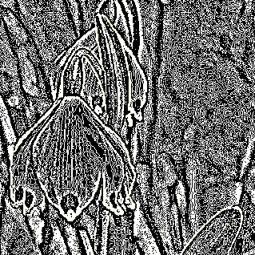
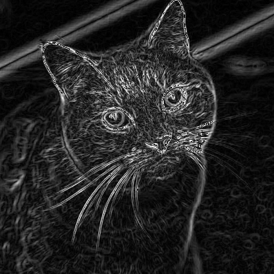
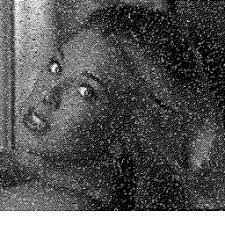
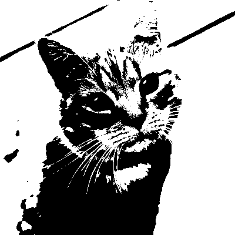

# Edge Detection in Java #
Implementation of filters, like those used by convolutional neuronal networks, for detecting edges in images. 

### Usage ###
You find the jar archive in `out/artifacts` 
```java
java -jar EdgeDetection.jar <path_to_image> -f <filter> -o <outfile>
```
### Available Filters ###

Following filters and operators are available:

- [Laplace Operator](https://en.wikipedia.org/wiki/Discrete_Laplace_operator#Image_Processing) (`laplace`) 
- [Sobel Operator](https://en.wikipedia.org/wiki/Sobel_operator) (`sobel`)
- [Prewitt Operator](https://en.wikipedia.org/wiki/Prewitt_operator) (`prewitt`)
- Scharr filter (`scharr`)
- [Threshold filter](https://en.wikipedia.org/wiki/Thresholding_(image_processing)) (`bin_threshold`)
- [Gaussian filter](https://en.wikipedia.org/wiki/Gaussian_filter) (`gaussian`) (Gaussian blur, no edge detection)

### Examples ###

Some examples of filters that have been applied to an image.

Filter | Before | After 
--- | --- | ---
Laplace Operator |  |  
Sobel Operator |  |  
Gaussian Filter |  |  
Threshold Filter |  |  
 
